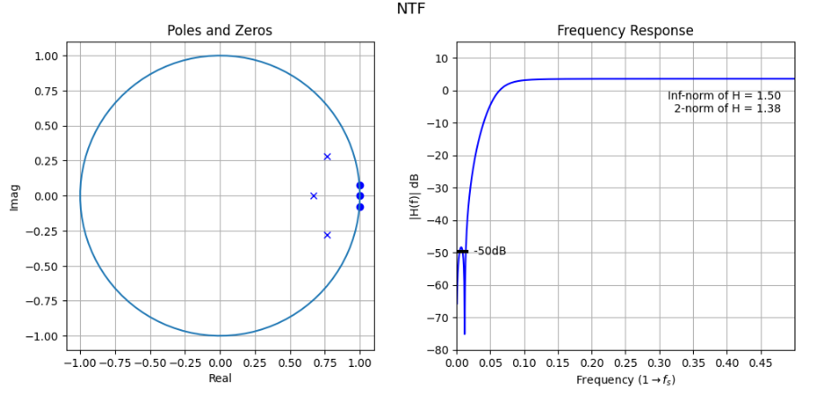
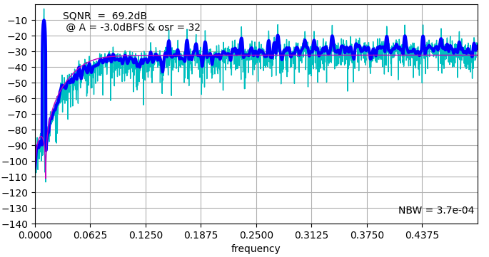
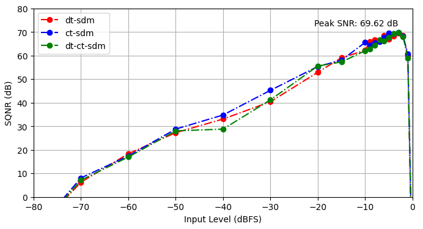
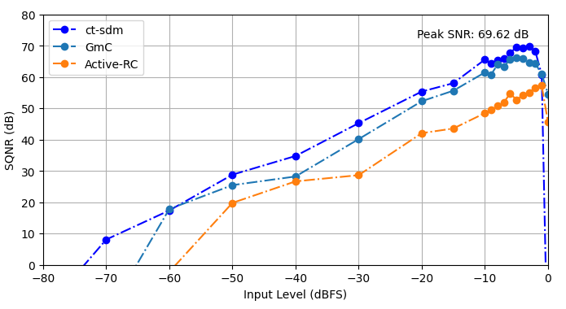
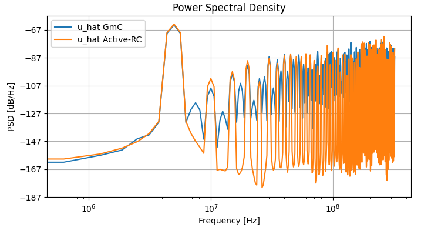
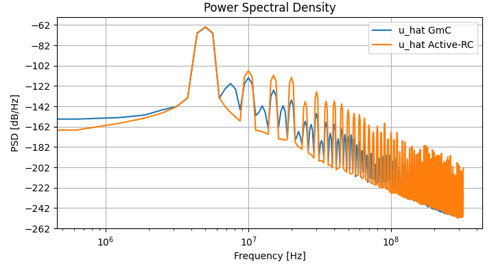
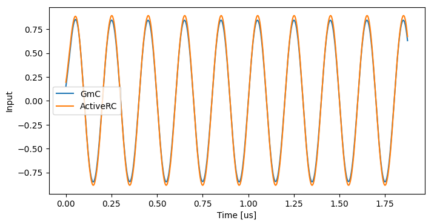

<h1>Sigma-Delta Design with CBADC (IMSE 2025) 🎛</h1>

<p>This Python toolset enables the design and simulation of advanced data conversion systems, focusing on mixed-signal architectures and filter implementations. Leveraging modern Python libraries, it provides tools for modeling and optimizing high-performance analog-to-digital conversion systems.</p>


<!-- Navigation Menu (Table of Contents) -->
<div align="left">
  <a href="#overview">📄 Overview</a><br>
  <a href="#features">✨ Features</a><br>
  <a href="#installation">⚙️ Installation</a><br>
  <a href="#usage-examples">💻 Usage Examples</a><br>
  <a href="#results-visualization">📊 Results Visualization</a><br>
  <a href="#features-development">🔧 Features in Development</a><br>
  <a href="#license">📝 License</a><br>
</div>


<h2 id="overview">📄 Overview</h2>

<p>This project provides a Python-based environment, using Jupyter notebooks, for designing and simulating Continuous-Time Binary-weighted ADC (CBADC) and traditional Sigma-Delta architectures. Expanding upon Schreier's established MATLAB toolbox, it extends the  capabilities for both continuous-time and discrete-time designs, with emphasis on practical circuit-level considerations.</p>


<h2 id="features">✨ Features</h2>

<!-- Key Features Table -->
<div>
  <table style="border-collapse: collapse; background-color: transparent;">
    <tr>
      <td><strong>Name</strong></td>
      <td><strong>Description</strong></td>
    </tr>
    <tr>
      <td>Python-based Delta Sigma Modulator Design</td>
      <td>Python codebase for simulating and designing Sigma-Delta modulators, including continuous-time (CT) and discrete-time (DT) filters, built upon Schreier's MATLAB toolbox for SDM tasks.</td>
    </tr>
    <tr>
      <td>Environment Setup</td>
      <td>Python virtual environment (venv) contains core packages: ipykernel, jupyterlab, and cbadc for development.</td>
    </tr>
    <tr>
      <td>CBADC Package Installation</td>
      <td>Direct GitHub installation of CBADC Python package for Sigma-Delta modulator design and analysis, with current features.</td>
    </tr>
    <tr>
      <td>Visualization with QR Code</td>
      <td>Generated QR code points to the GitHub repository for tutorial access across devices.</td>
    </tr>
    <tr>
      <td>Sigma-Delta Modulator Design</td>
      <td>Core parameters include bandwidth (Bw), oversampling ratio (osr), and filter order for SDM synthesis via cb.delsig.synthesizeNTF function.</td>
    </tr>
    <tr>
      <td>State-Space Realization of NTF</td>
      <td>NTF implementation for both discrete-time and continuous-time architectures using the cb.delsig.realizeNTF function.</td>
    </tr>
    <tr>
      <td>Continuous-Time Architecture Synthesis</td>
      <td>CT loop filter synthesis with cb.delsig.realizeNTF_ct function, with coefficient scaling matched to sampling frequency.</td>
    </tr>
    <tr>
      <td>Advanced Control Structures</td>
      <td>Filter state-space models and signal generation methods offer precise modulation and quantization control.</td>
    </tr>
    <tr>
      <td>Interactive Jupyter Notebooks</td>
      <td>Examples run in Jupyter notebooks for direct code testing and real-time results.</td>
    </tr>
    <tr>
      <td>Comprehensive Design Example</td>
      <td>Full walkthrough of continuous-time lowpass delta sigma ADC design, from initial parameters to performance analysis.</td>
    </tr>
  </table>
</div>

<h2 id="installation">⚙️ Installation</h2>

<div align="left">

1. Install <strong>Python >= 3.10</strong>.  
2. Create a virtual environment:
   
```bash
python -m venv imse2025
```

3. Activate the virtual environment:

<pre><code>python -m venv imse2025
source imse2025/bin/activate  # On Unix/macOS
</code></pre>
<pre><code>python -m venv imse2025
.\imse2025\Scripts\activate  # On Windows</code></pre>
</code></pre>

4. Installing Dependencies:

<pre><code>python -m pip install --upgrade pip ipykernel jupyterlab && \
python -m ipykernel install --user --name=imse2025 --display-name "imse 2025"
</code></pre>

5. Install the CBADC package:

<pre><code>python -m pip install git+https://github.com/hammal/cbadc.git@feature/0.4.0</code></pre>

<small>If the command above fails due to versioning or compatibility issues, install CBADC manually:</small>

<pre><code>git clone https://github.com/hammal/cbadc.git
cd cbadc
git checkout feature/0.4.0

pip install -e .
</code></pre>

<h2 id="usage-examples">💻 Usage Examples</h2>

<p>This section provides practical examples of designing and implementing different Sigma-Delta Modulator (SDM) architectures using the CBADC package.</p>

<h3>Basic SDM Design</h3>

<p>Define the fundamental parameters of a Sigma-Delta Modulator (SDM) and synthesize a Noise Transfer Function (NTF):</p>

<pre><code>import numpy as np
import cbadc as cb
import matplotlib.pyplot as plt

# Define system parameters
order = 3
osr = 32
nlev = 2
f0 = 0.
Hinf = 1.5
Bw = 10e6
fs = Bw * osr * 2

# Synthesize NTF
ntf0 = cb.delsig.synthesizeNTF(order, osr, 2, Hinf, f0)</code></pre>

<h3>Implementing Different Architectures</h3>

<p>Below are implementations of various continuous-time Sigma-Delta modulator architectures.</p>

<h3>Continuous-Time SDM</h3>

<p>Convert the discrete-time NTF into a continuous-time representation and define the system's analog frontend:</p>

<pre><code>ABCDc, tdac2 = cb.delsig.realizeNTF_ct(ntf0, form, tdac)
ct_analog_frontend = cb.AnalogFrontend.ctsdm(ABCDc, tdac2, quantization_levels=nlev)
ct_analog_frontend.dt = 1.0/fs</code></pre>

<h3>GmC Implementation</h3>

<p>Define a GmC-based integration structure for the analog frontend:</p>

<pre><code>GmC = cb.GmC(
    ct_analog_frontend, 
    Cint, 
    Ro, 
    Cp, 
    v_n=v_noise_rms, 
    slew_rate=slew_rate, 
    v_out_max=max_output_swing, 
    v_out_min=min_output_swing
)</code></pre>

<h3>Active RC Implementation</h3>

<p>Define an Active RC integration architecture, which is commonly used for stability and precision:</p>

<pre><code>active_RC = cb.ActiveRC(
    ct_analog_frontend, 
    Cint, 
    gm, 
    Ro, 
    Co
)</code></pre>

<h2 id="results-visualization">📊 Results Visualization</h2>

<h3>Frequency Domain Analysis</h3>
<p>These plots show the frequency spectrum of the analyzed signal, highlighting key frequency components.</p>

<br />


<h3>Simulation</h3>
<p>Simulation results illustrating the input signal levels used for analysis.</p>

<br />


<h3>Power Spectral Density</h3>
<p>Power Spectral Density (PSD) analysis of the modulator output, showing signal power distribution over frequency.</p>

<br />

<br />



<h2 id="features-development">🔧 Features in Development</h2>

<ul>
  <li><strong>Advanced Simulation Reporting:</strong> Provides enhanced details for maximum currents, voltages, and performance metrics.</li>
  <li><strong>Expanded Model Library:</strong> Incorporates best practices from leading simulation models, expanding the range of available options.</li>
  <li><strong>FIR DAC Support:</strong> This feature has been implemented but currently has a bug, which is expected to be resolved soon.</li>
  <li><strong>Refined Parametrization:</strong> Ongoing work on GmC and activeRC, with comprehensive documentation being developed.</li>
  <li><strong>MASH Design Flow:</strong> Focused on streamlining the design process with a more intuitive and efficient flow.</li>
  <li><strong>Pipeline Design Flow:</strong> Efforts are underway to create a more robust and seamless pipeline for the design process.</li>
  <li><strong>Quadrature CB-ADC Workflow:</strong> Dedicated to building an efficient workflow for precise analog-to-digital conversions.</li>
  <li><strong>DT-Time Models:</strong> Ongoing improvements to models for discrete-time simulations.</li>
  <li><strong>Validation & Comparison:</strong> Focused on validating and comparing with other SDM tools, like Sigma-Delta, as well as SPICE models to ensure accuracy and reliability.</li>
  <li><strong>Graphical Interfaces:</strong> Enhancing user experience with user-friendly, easy-to-navigate graphical interfaces.</li>
  <li><strong>Massive Simulation APIs:</strong> Implementing robust APIs to streamline dataset generation and simulation workflows.</li>
</ul>


<h2 id="license">📝 License</h2>

<p>This project is licensed under the GNU General Public License, Version 3, 29 June 2007. Everyone is permitted to copy and distribute exact copies of this license document, but modifications are not allowed. You can read the full license on the <a href="https://www.gnu.org/licenses/gpl-3.0.html" target="_blank">GNU website</a>.</p>

